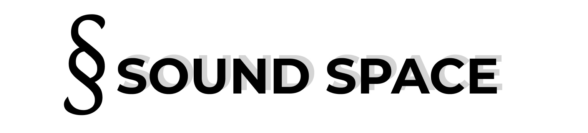

<p align="center"><a href="" target="_blank"></a></p>

<h3 align="center">Интернет-магазин музыкального оборудования</h3>

## Функции проекта

SoundSpace предоставляет следующие функции:

- Регистрация и авторизация пользователя
- Просмотр каталога товаров и поиск по категориям.
- Добавление товаров в корзину и оформление заказа.
- Админи панель для управления товарами, категориями и заказами.
- Докуменатация http://127.0.0.1:8000/api/documentation
- Документация разработанных функций ./docs/html/index.html

## Установка и настройка

Для установки и запуска проекта SoundSpace, выполните следующие шаги:

- Установите [OpenServerPanel](https://ospanel.io/). Он обеспечивает легкую настройку и управление сервером, необходимым для запуска проекта.

- Клонируйте репозиторий SoundSpace на свой локальный компьютер или сервер: 
```js
  git clone https://github.com/1bobofett1/MusicalShop.git
```

- Перейдите в папку проекта: 
```js
  cd C:\OSPanel\domains\MusicalShop
```
- Установите [Node.js](https://nodejs.org/ru/) не ниже версии 18.16.0, в процессе установки Node.js установите Node Package Manager.

- Установите зависимости, выполнив команду:
```js
  composer install
```

- Устанавливаем зависимости npm:
  
```js
  npm install
```

- Создайте файл .env из файла .env.example и настройте его, указав данные для вашей базы данных:
```js
  copy .env.example .env
```
Затем отредактируйте файл .env, установив следующие значения:
  |           Файл .env             |
  | ------------------------------- |
  | DB_CONNECTION = mysql           | 
  | DB_HOST = 127.0.0.1             |
  | DB_PORT = 3306                  |
  | DB_DATABASE = your_database_name|
  | DB_USERNAME = your_username     |
  | DB_PASSWORD = your_password     |

- Сгенерируйте ключ приложения:
```js
  php artisan key:generate
```

- Выполните миграции базы данных:
```js
  php artisan migrate
```

- Выполните сиды в базу данных:
```js
  php artisan db:seed
```

- Запустите локальный сервер разработки:
```js
  php artisan serve
```
После успешного запуска сервера, вы сможете получить доступ к SoundSpace по адресу: http://127.0.0.1:8000.

## Требования
- Node.js v18.16.0 или выше
- laravel не ниже v9.0
- Пакет Vue

## Разработчик
Проект разработал: ПНИПУ ст. гр. АТП-22-1м Фарваев Руслан Ринатович

Контактные данные: farvaev_ruslan@mail.ru
